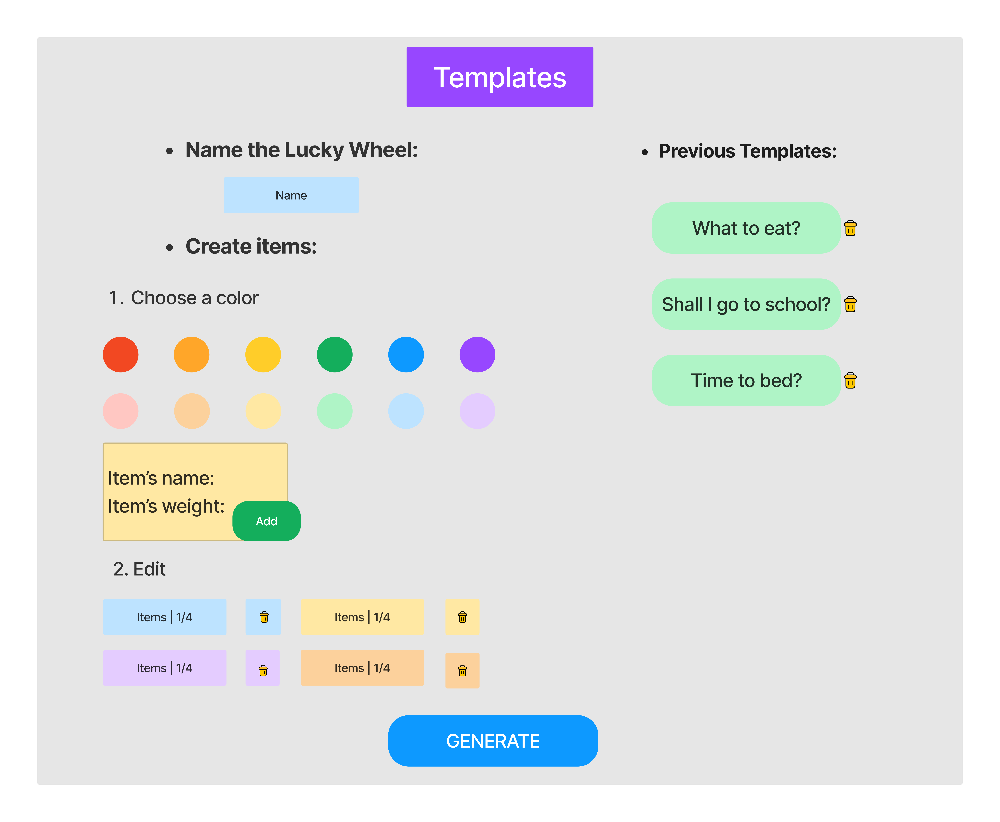
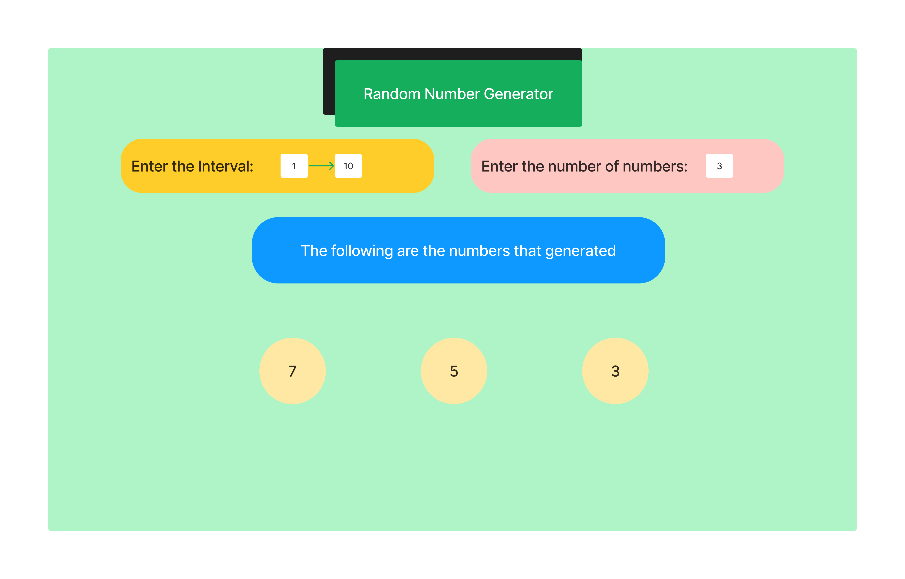
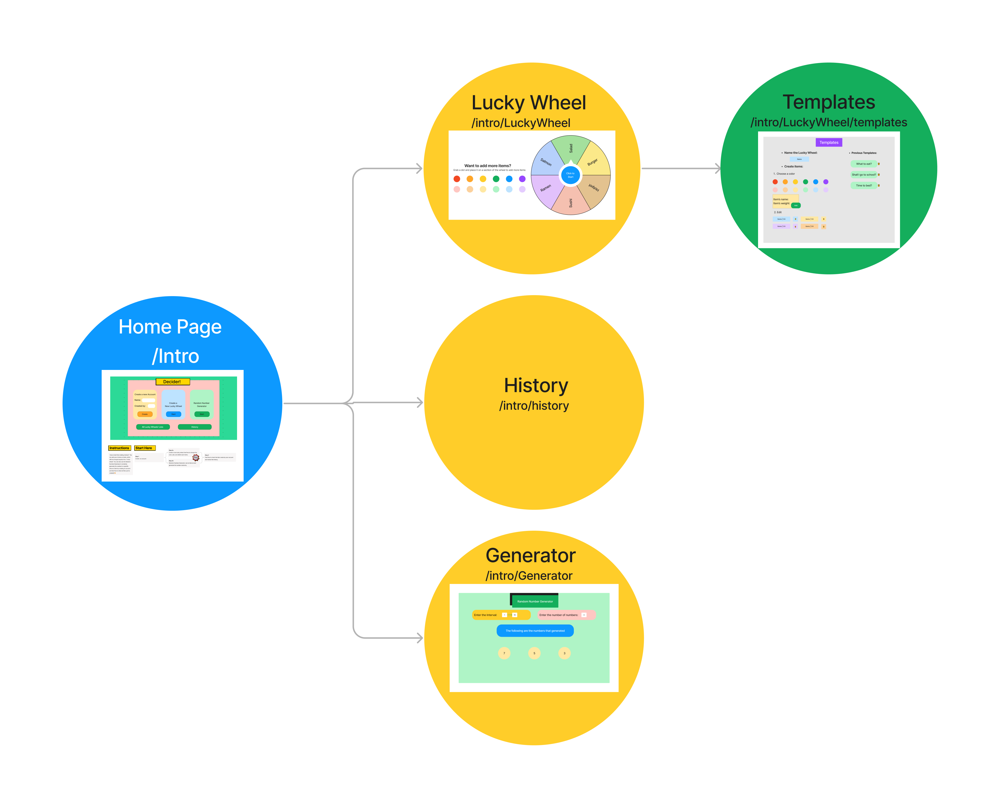

The content below is an example project proposal / requirements document. Replace the text below the lines marked "__TODO__" with details specific to your project. Remove the "TODO" lines.

(__TODO__: your project name)

# Shoppy Shoperson 

## Overview

(__TODO__: a brief one or two paragraph, high-level description of your project)

What's for dinner tonight? Should I say yes to him? What to review first for the upcoming exam? Who's next to do the housework?

We believe many of us have a hard time making some decisions nowadays. There is no best option, and there is no worst option! Then let "decider" choose randomly for you!
Coping with the difficulties of making choices, "decider" can help users make quick decisions to save time. No hesitation, let's obey the fate!

Decider is a web app that mainly for the users who have a hard time making choices, or the users who have many equally important tasks and feels hard to arrange the priority. Users can add their choices or tasks, which will be arranged equally into a "lucky wheel".
What's more, it's multifunctional in at any place, at any time -- the "lucky one" is always easily and fairly chosen. During class, it helps the teachers to select students randomly to answer the questions. During parties, it helps to pick people randomly or play truth or dare games.


## Data Model

(__TODO__:   

The application will store Users, Lists and Items

* users can have multiple lists (via references)
* each list can have multiple items (by embedding)

(__TODO__: sample documents)

An Example User:

```javascript
{
  username: "decider",
  hash: // a password hash,
}
```

An Example List with Embedded Items:

```javascript
{
  user: // a reference to a User object
  name: "Lucky Wheel-what should I eat tonight?",
  items: [
    { name: "ramen", weight: 0.3, color: 'red'},
    { name: "sushi", weight: 0.3, color: 'yellow'},
    { name: "salmon", weight: 0.4, checked: 'blue'},
  ],
  createdAt: // timestamp
}
```


## [Link to Commented First Draft Schema](db.mjs) 

(__TODO__: create a first draft of your Schemas in db.mjs and link to it)

## Wireframes

(__TODO__: wireframes for all of the pages on your site; they can be as simple as photos of drawings or you can use a tool like Balsamiq, Omnigraffle, etc.)

/intro - the home page


/intro/luckywheel - page for showing the lucky wheel


/intro/luckywheel/templates



/list/Genertator - page for showing the Ramdom Number Generator



## Site map

(__TODO__: draw out a site map that shows how pages are related to each other)

Here's a [complex example from wikipedia](https://upload.wikimedia.org/wikipedia/commons/2/20/Sitemap_google.jpg), but you can create one without the screenshots, drop shadows, etc. ... just names of pages and where they flow to.



## User Stories or Use Cases

(__TODO__: write out how your application will be used through [user stories](http://en.wikipedia.org/wiki/User_story#Format) and / or [use cases](https://en.wikipedia.org/wiki/Use_case))

1. as non-registered user, I can register a new account with the site
2. as a user, I can log in to the site
3. as a user, I can create a new grocery list
4. as a user, I can view all of the grocery lists I've created in a single list
5. as a user, I can add items to an existing grocery list
6. as a user, I can cross off items in an existing grocery list

## Research Topics

(__TODO__: the research topics that you're planning on working on along with their point values... and the total points of research topics listed)

* (5 points) Integrate user authentication
    * I'm going to be using passport for user authentication
    * And account has been made for testing; I'll email you the password
    * see <code>cs.nyu.edu/~jversoza/ait-final/register</code> for register page
    * see <code>cs.nyu.edu/~jversoza/ait-final/login</code> for login page
* (4 points) Perform client side form validation using a JavaScript library
    * see <code>cs.nyu.edu/~jversoza/ait-final/my-form</code>
    * if you put in a number that's greater than 5, an error message will appear in the dom
* (5 points) vue.js
    * used vue.js as the frontend framework; it's a challenging library to learn, so I've assigned it 5 points

10 points total out of 8 required points (___TODO__: addtional points will __not__ count for extra credit)


## [Link to Initial Main Project File](app.mjs) 

(__TODO__: create a skeleton Express application with a package.json, app.mjs, views folder, etc. ... and link to your initial app.mjs)

## Annotations / References Used

(__TODO__: list any tutorials/references/etc. that you've based your code off of)

1. [passport.js authentication docs](http://passportjs.org/docs) - (add link to source code that was based on this)
2. [tutorial on vue.js](https://vuejs.org/v2/guide/) - (add link to source code that was based on this)

