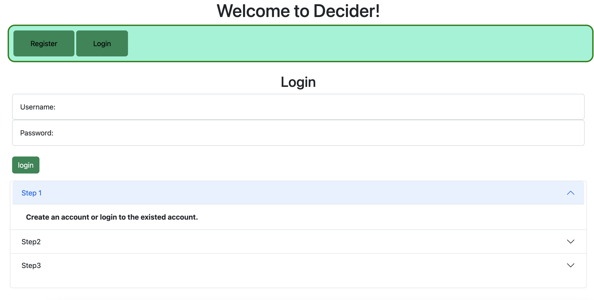
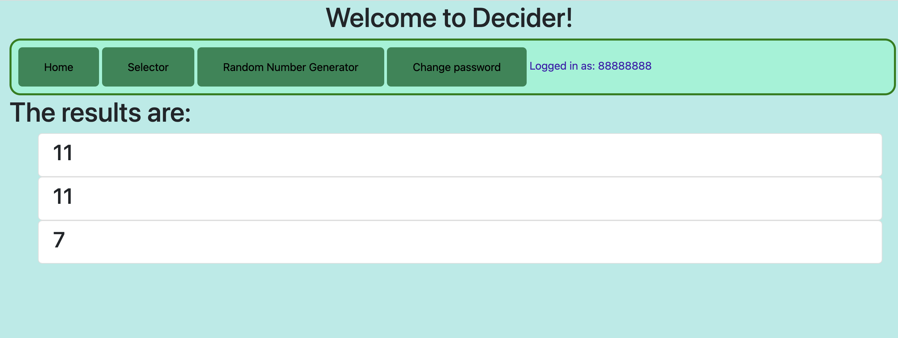

<!-- The content below is an example project proposal / requirements document. Replace the text below the lines marked "__TODO__" with details specific to your project. Remove the "TODO" lines.

(__TODO__: your project name) -->

# Decider

## Overview

<!-- (__TODO__: a brief one or two paragraph, high-level description of your project) -->

What's for dinner tonight? What to review first for the upcoming exam? Who's next to do the housework? Many of us are having a hard time making some decisions nowadays. There is no best option, and there is no worst option! Then let "decider" choose randomly for you!
Coping with the difficulties of making choices, "decider" can help users make quick decisions to save time. No hesitation, let's obey fate!

The decider is a web app that is mainly for users who have a hard time making choices or users who have many equally important tasks and feels hard to arrange the priority. Users can add their choices or tasks, which will be arranged equally into the table of "Selector", the system will help users to chose items from the table randomly. Users can also use the Random Number Generator to choose the numbers in any interval they want. 

What's more, it's multifunctional in any place, at any time -- the "lucky one" is always easily and fairly chosen. During class, it helps the teachers to select students randomly to answer the questions. During parties, it helps to pick people randomly or play truth or dare games.


## Data Model
<!-- 
(__TODO__:   

The application will store Users, Lists and Items

* users can have multiple lists (via references)
* each list can have multiple items (by embedding)

(__TODO__: sample documents) -->

An Example User:

```javascript
{
  username: "decider",
  hash: // a password hash,
}
```

An Example List with Embedded Items:

```javascript
{
  user: "username:// a reference to a User object"
  items: "ramen"
}
```


## [Link to Commented First Draft Schema](db.mjs) 

<!-- (__TODO__: create a first draft of your Schemas in db.mjs and link to it) -->

## Wireframes
<!-- 
(__TODO__: wireframes for all of the pages on your site; they can be as simple as photos of drawings or you can use a tool like Balsamiq, Omnigraffle, etc.) -->

/ - the home page


/register - page to register


/login - page to login



/random - page for random number generator




/luckywheel - page to add items to selector


/changepassword - page for changing password


## Site map

<!-- (__TODO__: draw out a site map that shows how pages are related to each other) -->

<!-- Here's a [complex example from wikipedia](https://upload.wikimedia.org/wikipedia/commons/2/20/Sitemap_google.jpg), but you can create one without the screenshots, drop shadows, etc. ... just names of pages and where they flow to. -->


## User Stories or Use Cases

<!-- (__TODO__: write out how your application will be used through [user stories](http://en.wikipedia.org/wiki/User_story#Format) and / or [use cases](https://en.wikipedia.org/wiki/Use_case)) -->

1. As non-registered user, I can register a new account with the site.
2. As a user, I can log in to the homepage.
3. As a user, I can add the new items to Selector table.
4. As a user, I can select items randomly from the table in Selector.
5. As a user, I can view all of the Selector lists I've created in a single list.
6. As a user, I can use the ramdom number generator to generate numbers randomly.
7. As a user, I can choose the interval for the random number generator.
8. As a user, I can enter the number of numbers I want to generate.
9. As a user, I can view the results that generated by the Random Number Generator.


## Research Topics
<!-- 
(__TODO__: the research topics that you're planning on working on along with their point values... and the total points of research topics listed) -->


* (2 points) Use a CSS framework or UI toolkit, use a reasonable customization of the framework
  * I used bootstrap as the CSS framework to designe the responsive websites quickly.
  * Bootstrap is a feature-packed frontend toolkit. It includes HTML and CSS based design templates for typography, forms, etc., and provides a collection of syntax for template designs.
* (3 points) Unit testing with JavaScript
  * I used mocha as the unit test to test some of my functions and show 4 test results. Please see the screenshot blow.
  Unit test:
  
* (5 points) Automated functional testing for all of my routes using Selenium
  * I used selenium to test my code automatically. The screenshot of four test processes and results are posted below.
  
  

* (3 points) Configuration management
  * I used dotenv to automatically loads environment variables from a . env file.
* (3 points) Use built tools / task runners such as vite, Webpack or even make (!) to automate any of the following … must be used in combination with one or more of the other requirements, such as:Use a CSS preprocesser Sass
  * I created a webpack.config.js file in webpack folder in order to automate the sass


13-16 points total out of 10 required points.


## [Link to Initial Main Project File](app.mjs) 

<!-- (__TODO__: create a skeleton Express application with a package.json, app.mjs, views folder, etc. ... and link to your initial app.mjs) -->

## Annotations / References Used

<!-- (__TODO__: list any tutorials/references/etc. that you've based your code off of) -->

1. [tutorial on React](https://github.com/facebook/react)
2. [UI toolkit Documentation](https://docs.unity3d.com/Manual/UIElements.html)
3. [tutorial on bootstrap](https://getbootstrap.com/)
4. [Mocha](https://www.youtube.com/watch?v=MLTRHc5dk6s&t=308s)
5. [Selenium](https://www.youtube.com/watch?v=j7VZsCCnptM)
6. [sass](https://www.youtube.com/watch?v=jUZzAUuMHVI)
7. [dotenv](https://www.youtube.com/watch?v=hZUNMYU4Kzo)


